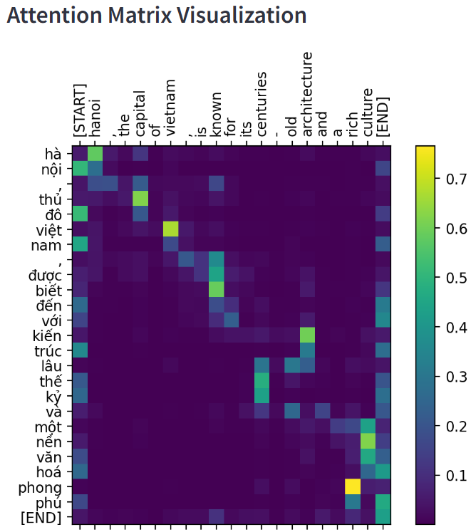

# English-Vietnamese Neural Machine Translation (NMT) using Transformer

This project implements an English-to-Vietnamese translation model using the Transformer architecture, as described in the seminal paper **"Attention is All You Need"**. The model is trained on the **PhoMT** dataset, containing 3 million sentence pairs, and achieves a BLEU score of **0.26**.

In addition, we utilize post-training quantization to reduce 20 MB the model size , making it more suitable for deployment on limited devices.

## Table of Contents

- [Dataset](#dataset)
- [Model Architecture and Training](#model-architecture-and-training)
- [Evaluation](#evaluation)
- [Interpretability](#interpretability)
- [Quantization](#quantization)
- [Future Improvements](#future-improvements)
- [References](#references)

## Dataset

We use the **PhoMT dataset** for training and evaluation, which contains **3 million sentence pairs** for English-Vietnamese translation. 
The dataset was preprocessed and tokenized for both source (English) and target (Vietnamese) languages using **Byte-Pair Encoding (BPE)** to handle out-of-vocabulary words.

- **Number of sentence pairs**: 3 million
- **Languages**: English (source) and Vietnamese (target)
- **Tokenization**: Byte-Pair Encoding (BPE)

### BPE for Vietnamese:

We compares **Byte-Pair Encoding (BPE)** and **word-level tokenization** for Vietnamese text, highlighting key differences in vocabulary size, handling of rare words, and out-of-vocabulary (OOV) robustness.

**Key Differences**

| Criteria               | BPE                           | Word-Level                  |
|------------------------|-------------------------------|-----------------------------|
| **Vocabulary Size**    | 42,000 tokens                 | 345,765 tokens              |
| **Rare Word Handling** | Good                          | Good                         |
| **OOV Handling (e.g., Person Names)** | Effectively handles OOV words | Cannot handle OOV words    |

**Summary**: BPE is preferred due to its:
- Significantly smaller vocabulary size, making it more efficient.
- Ability to handle OOV words, such as names, which is challenging for word-level tokenization.

## Model Architecture and Training

This project implements the **Transformer architecture**, as described in the paper [*Attention is All You Need*](https://arxiv.org/abs/1706.03762). 

**The key architecture configuration:**

- Number of Encoder/Decoder Layers: 4
- Model Dimension: 128
- Number of Attention Heads: 8
- Feedforward Layer Dimension: 512

**The key training configuration:**

- Loss function: Masked Cross-entropy
- Optimizer: Adam 
- Batch size: 128
- Number of epochs: 10
- GPU usage: NVIDIA RTX 4090

## Evaluation

### Bilingual Evaluation Understudy (BLEU)
- BLEU measures **n-gram overlap** between predicted and reference translations (up to 4-grams).
- **Model Score**: BLEU = 0.27
- **Note**: BLEU is widely used for assessing translation fluency and precision.

### Translation Error Rate (TER)
- TER calculates the **number of edit steps** (insertions, deletions, substitutions) needed to align the predicted translation with the reference.
- **Model Score**: TER = 0.57 (0: best, 1: worst)
- **Note**: TER penalizes translations with incorrect word order.

For more information, see: *“A Study of Translation Edit Rate with Targeted Human Annotation.”*

### Sample Translations

Here are a few examples of translations produced by the model:

- **Input**: "The weather is nice today."
  - **Output**: "thời tiết hôm nay đẹp lắm."
  
- **Input**: "I am learning machine translation."
  - **Output**: "tôi đang học bản dịch máy."

You can also use the trained model for translating sentences by running the notebook: `running_translation.ipynb`

## Interpretability
### 1. Attention Score Heatmap
- **Purpose**: Helps visualize the model's internal workings by showing attention scores in cross-attention modules.
- **Use Case**: Inspect translation errors, identify areas for data correction, and guide model fine-tuning.

### 2. Translation Confidence Scores

**Translation Confidence Scores** provide insight into the certainty of each predicted word in a translation by analyzing the entropy of the probability distribution over the vocabulary for each word. This allows us to identify high-confidence predictions versus uncertain ones, which can help improve translation reliability and guide further adjustments.

**Calculate Entropy**:
- For each predicted word, calculate the **entropy** of the probability distribution over the entire vocabulary.
- Entropy is a measure of uncertainty: lower entropy indicates that the model is **more confident** about the chosen word, while higher entropy suggests  **uncertainty**.

**Define Confidence Threshold**:
- Set a threshold to classify high-confidence predictions.
- A reasonable threshold is defined as **half of the maximum entropy**, calculated as:

  $\text{Threshold} = \frac{\log(\text{vocab\_size})}{2}$

- Interpret the Confidence Scores:
  - If the entropy of the predicted word’s is below the threshold, the model is considered confident in its prediction. 
  - If the entropy is above the threshold, the model is less certain, which might indicate a potential error or ambiguity in translation.

## Quantization
This section focuses on **post-training quantization** to reduce the size of the trained model. We quantized the multi-head attention, cross-attention, and the dense layer.

Post-training quantization includes:
- Quantized data types: int8, uint8, float16.
- Quantization techniques: symmetric and asymmetric.

### Result of PTQ:
- Reduce model size from 110MB to 90MB. 

## Future Improvements

- **Data Augmentation**: Explore synthetic data generation to increase the size of the training dataset.
- **Hyperparameter Tuning**: Experiment with different learning rates, batch sizes, and number of layers.
- **Transfer Learning**: Use pretrained models for fine-tuning on the English-Vietnamese task.

## References

1. **Vaswani et al.**, *Attention is All You Need*, [arXiv](https://arxiv.org/abs/1706.03762), 2017.
2. **PhoMT Dataset**: [Link to the dataset](https://github.com/VinAIResearch/PhoMT)
3. **BLEU Metric**: [BLEU](https://en.wikipedia.org/wiki/BLEU)
4. **Quantization**: [link](https://openaccess.thecvf.com/content_cvpr_2018/html/Jacob_Quantization_and_Training_CVPR_2018_paper.html)
